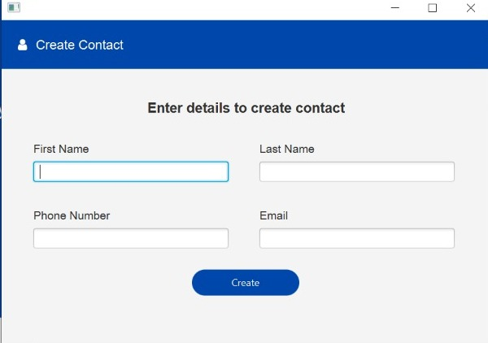
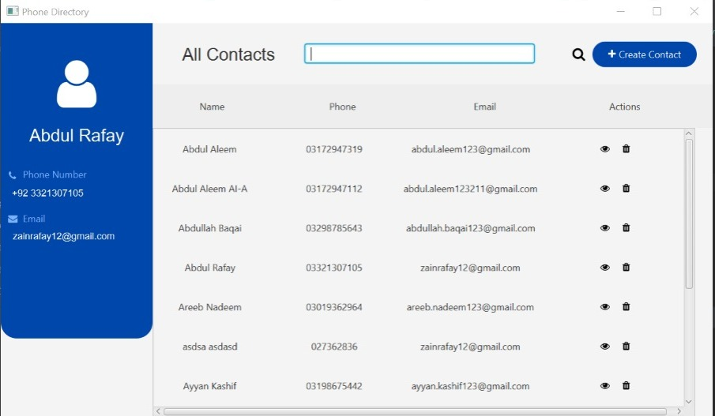

# Data Structure Project
# 
Phone Directory

### Introduction
- GUI BASED Phone Directory using IntelliJ Idea

### GUI Framework
- JavaFX

### Database
- MongoDB

### Features
- Add Contacts
- Search Contacts
- Delete Contacts

### Data Structures Used
- Trie
- AVL Tree
- LinkedList
- Hashmaps

### Algorithms Used
- DFS (Depth First Search)
- Binary Search
- Bubble Sort

### Flow Of Program
1. All the contacts are stored in the database
2. They are retrieved from the database and stored in AVL tree and trie
3. They are displayed through Linked List on the GUI

## Interface

<h3>Add Contact</h3>

<h3>All Contacts</h3>

<h3>Side Bar</h3>

<h4>Contributors</h4>

Abdul Rafay - 21k3076

Muneer Raza - 21k3084

Zainab Irshad - 21k4739

